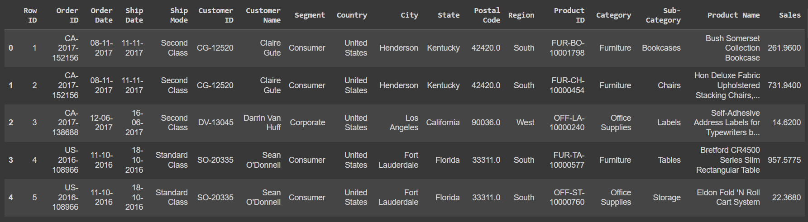
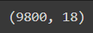
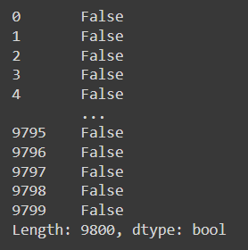
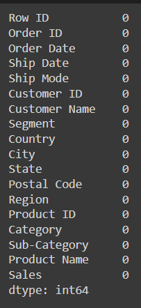
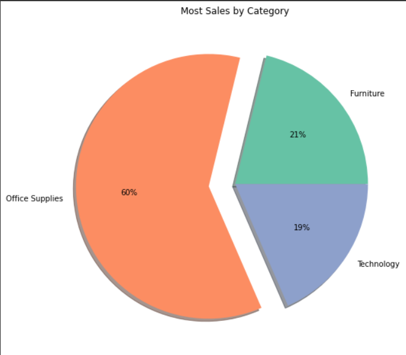
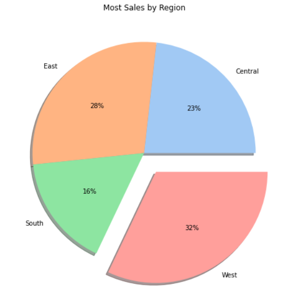
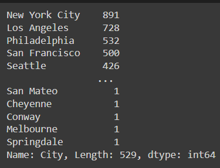
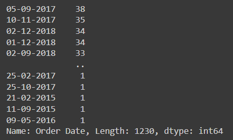
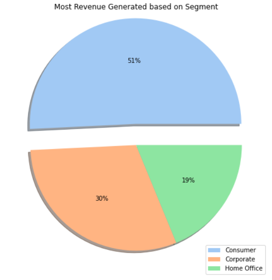

# Ex03-Univariate-Analysis
## Aim:
To perform Univariate Analysis on the given dataset.
## Algorithm:
### STEP 1
Read the given Data

### STEP 2
Get the information about the data

### STEP 3
Preprocess the data

### STEP 4
Fill null values in PINCODE column using mode() method

### STEP 5
Analyse the data using both statistical and graphical method

## Program Code:
```
'''
Program 
Developed by: Ashwin Raaj.S
Register no:212221230008
'''
import pandas as pd
import numpy as np
import seaborn as sns
import matplotlib.pyplot as plt

df = pd.read_csv("SuperStore.csv")
df

df.head()

df.info()

df.describe()

df.tail()

df.shape

df.columns

df.isnull().sum()

df.duplicated()

df['Postal Code'] = df['Postal Code'].fillna(df['Postal Code'].mode()[0])

df.isnull().sum()

df_count = df.groupby(by=["Category"]).count()
labels=[]
for i in df_count.index:
    labels.append(i)
plt.figure(figsize=(8,8))
colors = sns.color_palette("Set2")
myexplode = [0, 0.2,0]
plt.pie(df_count["Sales"], colors = colors,explode = myexplode, labels=labels, autopct = "%0.0f%%",shadow = True) 
plt.title("Most Sales by Category")
plt.show()

df_region = df.groupby(by=["Region"]).count()
labels = []
for i in df_region.index:
    labels.append(i)
plt.figure(figsize=(8,8))
colors = sns.color_palette('pastel')
myexplode = [0, 0,0,0.2]
plt.pie(df_region["Sales"], colors = colors,explode = myexplode, labels=labels, autopct = "%0.0f%%",shadow = True)
plt.title("Most Sales by Region")
plt.show()

df['City'].value_counts()

df['Order Date'].value_counts()

df_segment = df.groupby(by=["Segment"]).sum()
labels = []
for i in df_segment.index:
    labels.append(i)

plt.figure(figsize=(8,8))
colors = sns.color_palette('pastel')
myexplode = [0.2, 0,0]
pie = plt.pie(df_segment["Sales"], colors = colors,explode = myexplode, autopct = "%0.0f%%",shadow = True)
plt.title("Most Revenue Generated based on Segment")
plt.legend(pie[0], labels, loc="upper corner")
plt.show()
```
## Output :
### Dataset

### Dataset Head

### Dataset Info

### Dataset Describe

### Dataset Tail

### Dataset Shape

### Dataset Columns

### Null Values - Pre Cleaning

### Dataset Duplicated

### Null Values - Post Cleaning

### Univariate Analysis - Category

### Univariate Analysis - Region

### Univariate Analysis - City

### Univariate Analysis - Order Date

### Univariate Analysis - Segment


## Result:
The given dataset is read and univariate analysis is performed. The inferences are:

1. Most sales were from "Office Supplies" category
2. Most sales were from "West" Region
3. Most sales were from "New York City"
4. On "September 5th 2017" most sales took place - A total of 38
5. Most Revenue is generated from the "Consumer" segment.